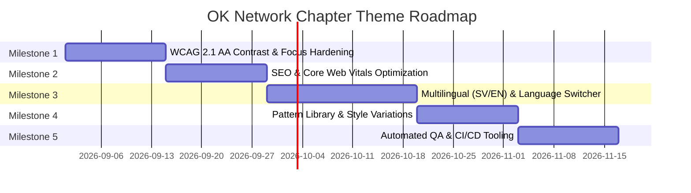

# OK Network Chapter — Theme Roadmap & Improvement Plan

This document outlines the review findings, quality assurance goals, accessibility compliance targets (WCAG 2.1 AA / WCAG 3.0), SEO optimizations, and milestone-based roadmap for the **OK Network Chapter** WordPress theme.

---

## 🎯 Strategic Goals

1. **Accessibility Excellence (WCAG 2.1 AA & WCAG 3.0 Readiness)**: Ensure high contrast, reliable keyboard navigation, predictable screen-reader landmarks, and minimum 44×44px touch targets.
2. **Core Web Vitals & Technical SEO**: Achieve 95+ PageSpeed scores through zero-layout-shift font preloading, semantic HTML5 landmarks, Schema.org structured data, and efficient block rendering.
3. **Seamless Multilingual Experience**: Support Swedish (`sv-SE`) as the default language with optional English (`en-US`) fallback, automatic browser language negotiation (`Accept-Language`), bot-safe SEO handling, and `hreflang` tags.
4. **Chapter Reusability**: Maintain a flexible block-theme foundation that any Open Knowledge chapter can adopt by swapping style variations, logos, and localized patterns.

---

## 🗺️ Milestone Roadmap



---

### 📌 Milestone 1: Accessibility & WCAG 2.1 AA Compliance (v3.1.0) — ✅ COMPLETED
*Target: Full compliance with WCAG 2.1 AA standards and early alignment with WCAG 3.0 APCA guidelines.*

- [x] **Contrast Corrections**:
  - Update `okfn-link` (`#00a9e0` -> `#006cb8`) to achieve ≥ 4.5:1 contrast against white backgrounds.
  - Add text underlines to links within body copy (`p a`, `li a`) to comply with WCAG 1.4.1 (not relying on color alone).
  - Update footer link hover state from `#ffffff` (low contrast on `#00d1ff`) to high-contrast `#231f20` with underline.
- [x] **Focus State Enhancement**:
  - Replace low-contrast focus outlines with high-contrast 2px solid rings (`#231f20` / `#005fa3`) with 2px offset for keyboard navigation.
  - Ensure the skip-to-content link (`.wp-block-skip-link`) is prominently visible upon initial tab keypress.
- [x] **Touch Target Sizing**:
  - Ensure all interactive elements (social icons, navigation items, buttons) have a minimum hit area of 44×44px.
- [x] **Screen Reader & Semantic Landmarks**:
  - Audit and standardize heading levels (`<h1>` -> `<h2>` -> `<h3>`) across all block patterns (`hero-punch`, `feature-cards`, `latest-posts`).
  - Add clear `aria-label` tags to icon-only buttons (search toggle, mobile menu button, social links).

---

### 📌 Milestone 2: SEO & Core Web Vitals Optimization (v3.2.0) — ✅ COMPLETED
*Target: Sub-second First Contentful Paint (FCP), zero Cumulative Layout Shift (CLS), and crawlability.*

- [x] **Font Preloading & Performance**:
  - Inject `<link rel="preload">` in `wp_head` for primary fonts (`HKGrotesk-Regular.woff2` and `HKGrotesk-Bold.woff2`) to prevent layout shift and FOUT.
- [x] **Structured Data (Schema.org)**:
  - Add JSON-LD structured data support for `Organization`, `WebSite`, and `Article` schema.
  - Integrate breadcrumbs support for deep page hierarchies.
- [x] **Image Optimization & CLS Prevention**:
  - Ensure explicit `width` and `height` attributes are declared on all SVGs and fallback theme images.
- [x] **Search Engine Indexing**:
  - Test compatibility with WordPress core XML Sitemaps (`/wp-sitemap.xml`) and popular SEO plugins (Yoast, Rank Math, SEOPress).
  - Add Open Graph and Twitter Card fallback meta tags for social media sharing.

---

### 📌 Milestone 3: Multilingual Architecture (ES / EN & SV / EN) (v3.3.0) — ✅ COMPLETED
*Target: Network chapter branch default with Spanish (`es_ES`) and English (`en_US`) fallback (with Swedish `sv_SE` on the Sweden build), automatic browser language negotiation, and dynamic hreflang tags.*

- [x] **URL & Routing Structure**:
  - Primary language at root (`https://chapter.okfn.org/`, `lang="es"` or `lang="sv"`).
  - English section at `/en/` (`https://chapter.okfn.org/en/`, `lang="en"`).
- [x] **Browser Language Negotiation**:
  - Implemented bot-safe HTTP `Accept-Language` detection helper (`okfn_chapter_get_browser_language()`).
  - Visitor language preferences stored via cookie (`okfn_lang`).
  - Search engine spiders (Googlebot, Bingbot, etc.) detected and never redirected (`okfn_chapter_is_bot()`).
- [x] **SEO `hreflang` Support**:
  - Output bidirectional `hreflang` alternate links in `wp_head`:
    ```html
    <link rel="alternate" hreflang="es" href="https://chapter.okfn.org/" />
    <link rel="alternate" hreflang="en" href="https://chapter.okfn.org/en/" />
    <link rel="alternate" hreflang="x-default" href="https://chapter.okfn.org/" />
    ```
- [x] **Header Language Switcher**:
  - Created dedicated accessible Header Language Switcher pattern (`patterns/language-switcher.php`) integrated into `parts/header.html` with pill styling.
  - Full compatibility with Polylang / Polylang Pro FSE blocks.
- [x] **Complete Translation Bundles**:
  - Created Spanish translations `languages/okfn-chapter-es_ES.po` and high-performance `languages/okfn-chapter-es_ES.l10n.php`.
  - Maintained Swedish translations (`languages/okfn-chapter-sv_SE.po` and `languages/okfn-chapter-sv_SE.l10n.php`) and template `languages/okfn-chapter.pot`.

---

### 📌 Milestone 4: Block Patterns & Customization (v3.4.0) — ✅ COMPLETED
*Target: Expand pattern library for chapters with zero page-builder dependencies.*

- [x] **New Block Patterns**:
  - Project showcase & Case study cards (`patterns/project-cards.php`).
  - Event / Meetup listing pattern (`patterns/events.php`).
  - FAQ / Accordion pattern with accessible HTML `<details>` and `<summary>` (`patterns/faq-accordion.php`).
  - Donation & Membership CTA block with multiple payment options (`patterns/donate-cta.php`).
- [x] **Style Variations**:
  - Added `styles/chapter-purple.json`, `styles/chapter-yellow.json`, and `styles/dark-mode.json`.
- [x] **Site Editor Documentation**:
  - Created comprehensive volunteer and editor guide in [`docs/editor-guide.md`](docs/editor-guide.md).

---

### 📌 Milestone 5: Quality Assurance, Automated Testing & CI/CD (v3.5.0)
*Target: Automated validation on every commit and release packaging.*

- [ ] **Automated Testing Suite**:
  - GitHub Actions workflow for PHP syntax check (`php -l`) and PHP_CodeSniffer with WordPress-Core / WordPress-VIP rules.
  - Automated `theme.json` validation against official WordPress schema (`schemas.wp.org/wp/7.0/theme.json`).
  - Automated accessibility auditing with Pa11y / axe-core in CI.
- [ ] **Release Packaging**:
  - GitHub Actions workflow to build clean production zip archives (`okfn-chapter.zip`) excluding dev dependencies on release tag.

---

## 📊 Summary of Review & QA Findings

| Category | Finding | Recommended Fix | Severity |
|---|---|---|---|
| **A11y** | Link color `#00a9e0` on `#ffffff` is 2.88:1 (fails WCAG AA 4.5:1). | Darken to `#006cb8` (4.64:1) + underline body links. | 🔴 High |
| **A11y** | Focus outline `#00d1ff` has 1.45:1 contrast against white background. | Use `#005fa3` with 2px offset. | 🔴 High |
| **Performance** | Webfonts (`HK Grotesk`) are self-hosted but not preloaded. | Add `<link rel="preload">` in `wp_head`. | 🟡 Medium |
| **SEO / i18n** | Lack of bidirectional `hreflang` tags and browser language switcher. | Implement `hreflang` injector and header language toggle. | 🔴 High |
| **UX** | Footer social links have small touch area on mobile. | Increase hit area to 44×44px. | 🟢 Low |
